# Do Microstructure Features Help LLMs Find Better Alpha?

## Overview

This repository contains the **alpha-discovery platform** for an A/B experiment
on NQ E-mini futures. An autonomous LLM agent writes Python signal functions,
submits them to a locked evaluation engine, reads the results, and iterates —
searching for robust intraday trading signals without human intervention.

The central question: does giving the agent microstructure features derived from
Level-1 market data (order flow imbalance, micro-price, cumulative volume delta)
lead to measurably better signals than restricting it to standard OHLCV bars?

## System Architecture

```mermaid
flowchart LR
    subgraph Workspace["MUTABLE Research Workspace"]
        Agent["LLM Agent"]
        SignalFn["Signal Function<br/>generate_signal(df, params)"]
        Agent -->|iterate hypotheses| SignalFn
    end

    subgraph Framework["IMMUTABLE Framework (SHA-256 locked)"]
        Lock["Framework Lock Verification"]
        Loader["Data Loader + ExecutionMode Firewall<br/>RESEARCH: test blocked<br/>PROMOTION: test allowed"]
        Features["Feature Builder / Cache"]
        Backtest["Backtest Engine<br/>next-open entries + realistic costs"]
        Gauntlet["Research Gauntlet (7 tests)"]
    end

    subgraph Promotion["Promotion Pipeline"]
        Candidate["Candidate Artifact<br/>(hash-verified)"]
        PromoteCLI["scripts/promote.py"]
        WFA["Promotion Gates<br/>WFA + embargo/purge + lockbox"]
        DSR["Deflated Sharpe Gate<br/>(effective trials)"]
        Verdict["Promotion Verdict<br/>PASS / FAIL"]
    end

    SignalFn -->|research mode| Loader
    Loader --> Features --> Backtest --> Gauntlet --> Candidate
    Candidate --> PromoteCLI --> WFA --> DSR --> Verdict
    Lock --> PromoteCLI
    Gauntlet -->|feedback loop| Agent
```



## A/B Experiment Design

The experiment compares two groups that differ only in the input feature space
available to the LLM agent:

|                             | Group A (OHLCV)                 | Group B (OHLCV + MBP1)                 |
| --------------------------- | ------------------------------- | -------------------------------------- |
| **Price bars**              | Open, High, Low, Close, Volume  | Same                                   |
| **Technical indicators**    | EMAs, RSI, ATR, Bollinger Bands | Same                                   |
| **Microstructure features** | —                               | OFI, Micro-Price, CVD, Queue Imbalance |
| **Evaluation engine**       | Identical                       | Identical                              |
| **Transaction costs**       | $14.50 RT                       | $14.50 RT                              |

Same agent, same engine, same rules — only the feature space changes.

## Repository Structure

```
.
├── src/framework/                        # Immutable evaluation layer (13 hash-locked files)
│   ├── api.py                            # Stable public API surface
│   ├── backtest/
│   │   ├── engine.py                     # Bar-by-bar backtest with PT/SL/time-stop
│   │   ├── metrics.py                    # 16 financial metrics (Sharpe, PF, MDD, win rate, …)
│   │   ├── validators.py                 # 7-test validation gauntlet
│   │   └── costs.py                      # Adaptive transaction cost model
│   ├── data/
│   │   ├── loader.py                     # Parquet loader with ExecutionMode firewall
│   │   ├── constants.py                  # Tick size, costs, splits, thresholds
│   │   ├── bars.py                       # Time, volume, and tick bar aggregation
│   │   └── splits.py                     # Train / validate / test date ranges
│   ├── features_canonical/               # 16 feature modules + builder
│   │   ├── orderflow.py                  # OFI, buy/sell pressure, volume imbalance
│   │   ├── book.py                       # Depth imbalance, bid-ask spread, book skew
│   │   ├── microstructure.py             # Tape speed, whip bars, recoil, VPIN
│   │   ├── microstructure_v2.py          # Trade clustering, size anomalies
│   │   ├── aggressor.py                  # CVD, CVD divergence, extreme aggression
│   │   ├── momentum.py                   # Returns, EMAs, RSI, rate-of-change
│   │   ├── toxicity.py                   # Flow toxicity, adverse selection
│   │   ├── statistical.py                # Skew, kurtosis, entropy, Hurst exponent
│   │   ├── volume_profile.py             # POC distance, VA position, HVN/LVN
│   │   ├── footprint.py                  # Delta intensity, stacked imbalances
│   │   ├── opening_range.py              # OR high/low, range width, breakout signals
│   │   ├── scalping.py                   # Trap/break setups (standalone, not in canonical pipeline)
│   │   ├── pipeline.py                   # Regime detection, time features, interactions
│   │   ├── multi_timeframe.py            # 5 min aggregates of top-20 1 min features
│   │   ├── ohlcv_indicators.py            # SMA, EMA, RSI, ATR, Bollinger, MACD, Stochastic, ADX, OBV
│   │   ├── labels.py                     # Forward returns (ML targets)
│   │   └── builder.py                    # Feature matrix construction and caching
│   ├── validation/
│   │   ├── robustness.py                 # Deflated Sharpe, PBO, adversarial validation
│   │   ├── alpha_decay.py                # Temporal decay (STABLE / DECAYING / NOISY / DEAD)
│   │   └── factor_attribution.py         # Pure alpha vs. factor exposure (OLS)
│   └── security/
│       └── framework_lock.py             # SHA-256 manifest verification
│
├── research/                             # Mutable workspace (LLM agent operates here)
│   ├── signals/
│   │   └── example_ema_turn.py           # Reference signal implementation
│   ├── ml/
│   │   └── promotion_gates.py            # Purged/embargoed WFA promotion gates
│   └── lib/
│       ├── atomic_io.py                  # Thread-safe atomic JSON writes
│       ├── candidates.py                 # Write-once candidate artifacts
│       ├── coordination.py               # File locks, task state, heartbeat
│       ├── experiments.py                # Experiment logging
│       ├── budget.py                     # Mission budget persistence
│       ├── trial_counter.py              # Raw + effective trial count for deflated Sharpe
│       ├── feature_groups.py            # A/B group feature filtering (OHLCV vs OHLCV+MBP1)
│       └── promotion.py                  # Candidate artifact verification
│
├── configs/
│   ├── framework_lock.json               # SHA-256 manifest of locked files
│   ├── missions/
│   │   └── alpha-discovery.yaml          # Research mission specification
│   └── modern_meta.yaml                  # Strategy config (bar types, risk params)
│
├── scripts/
│   ├── research.py                       # Autonomous research loop entrypoint
│   ├── promote.py                        # Candidate promotion gate runner
│   └── framework/
│       ├── build_lock.py                 # Build framework integrity manifest
│       ├── verify_lock.py                # Verify integrity before runs
│       └── set_readonly.py               # Set framework files read-only
│
├── tests/                                # Full test suite (unit + integration)
└── docs/                                 # Architecture, validation, agent guide
```

## Signal Contract

Every signal the LLM agent produces must conform to a strict interface:

```python
def generate_signal(df: pl.DataFrame, params: dict) -> np.ndarray:
    """
    Args:
        df: Feature matrix (OHLCV + canonical features, ~170 columns)
        params: Strategy parameters

    Returns:
        Array of {-1, 0, 1} (short, flat, long), same length as df, no NaNs
    """
```

Execution uses `entry_on_next_open=True`: a signal at bar T triggers entry at
bar T+1 open, preventing lookahead bias. Intra-bar profit-target and stop-loss
use high/low for worst-case fills.

## Anti-Overfitting Controls

| Control                | Implementation                                               |
| ---------------------- | ------------------------------------------------------------ |
| **Framework lock**     | SHA-256 manifest of 13 evaluation-chain files (engine, metrics, validators, splits, loader, constants, builder); feature computation modules are mutable research inputs |
| **Split firewall**     | `ExecutionMode.RESEARCH` blocks all access to the test split |
| **Deflated Sharpe**    | Corrects observed Sharpe for number of hypotheses tested     |
| **Effective trials**   | Correlation-adjusted trial counting (`sqrt_family`) for DSR  |
| **Shuffle test**       | Signal must beat 100 random permutations (p < 0.05)          |
| **Walk-forward**       | Rolling out-of-sample windows must show positive performance |
| **Regime stability**   | Must be profitable in both high-vol and low-vol regimes      |
| **Cost sensitivity**   | Must remain profitable at 1.5x transaction costs ($21.75 RT); 2x PnL also reported |
| **Alpha decay**        | Exponential fit on rolling Sharpe; half-life > 120 days      |
| **Factor attribution** | OLS decomposition isolates pure alpha from factor exposure   |
| **Promotion WFA gates**| Purged/embargoed month-based walk-forward + lockbox gates    |

## Data

Raw data is sourced from [Databento](https://databento.com) MBP1 (Market-by-Price
Level 1) for NQ E-mini Nasdaq-100 futures — best bid/ask prices and sizes plus
individual trades with aggressor-side flags at nanosecond precision in Parquet
format.

| Split    | Period              | Purpose                             |
| -------- | ------------------- | ----------------------------------- |
| Train    | Mar 2023 – Aug 2024 | Feature engineering, model training |
| Validate | Feb 2025 – Jun 2025 | Signal evaluation, gauntlet testing |
| Test     | Jul 2025 – Jan 2026 | Holdout (blocked in research mode)  |

Data is not included. Set `NQ_DATA_PATH` to your raw data directory.

## Setup

```bash
# Linux/macOS
export NQ_DATA_PATH="/path/to/NQ_raw"

# Windows PowerShell
# $env:NQ_DATA_PATH="C:\Users\Andreas Oberdörfer\Downloads\generator\data\NQ_raw"

uv sync                                                                         # install dependencies
uv run pytest -q                                                                # run tests
uv run python scripts/framework/verify_lock.py --manifest configs/framework_lock.json --mode error   # verify integrity
uv run python scripts/research.py --mission configs/missions/alpha-discovery.yaml --max-experiments 100 --auto-mode  # research loop
uv run python scripts/promote.py --candidate research/candidates/<strategy_id>.json --verify-only        # promotion verification
```

## Promotion Workflow

`scripts/promote.py` is the final anti-overfitting gate before holdout conclusions:

1. Verify framework lock + candidate artifact hashes.
2. Run walk-forward validation over month-based folds.
3. Apply optional embargo and purge between train/test boundaries.
4. Compute aggregate Sharpe + Deflated Sharpe (effective trials aware).
5. Optionally evaluate a final lockbox period.

Example:

```bash
uv run python scripts/promote.py \
  --candidate research/candidates/<strategy_id>.json \
  --train-months 12 \
  --test-months 2 \
  --step-months 2 \
  --embargo-months 1 \
  --purge-days 5
```

## Documentation

| File                  | Contents                                                                   |
| --------------------- | -------------------------------------------------------------------------- |
| `docs/PLATFORM.md`    | Layer boundaries, execution modes, framework lock, runtime coordination    |
| `docs/VALIDATION.md`  | Gauntlet details, robustness metrics, alpha decay, factor attribution      |
| `docs/AGENT_GUIDE.md` | Agent constraints, creative scope, signal contract, research loop protocol |
